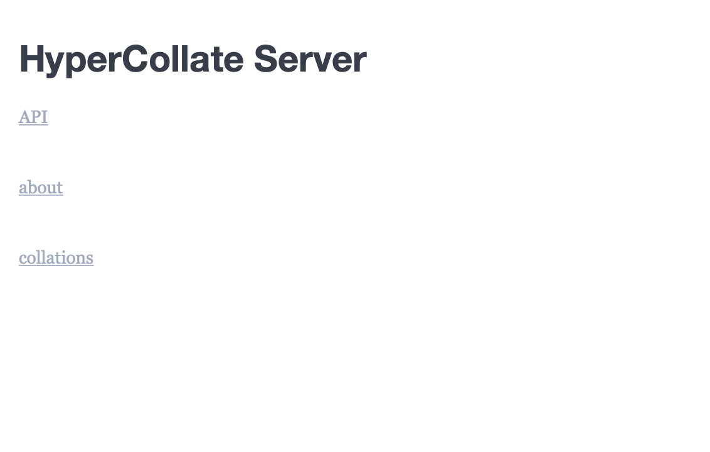

# HyperCollate

## General
HyperCollate is a prototype collation engine that is able to handle *in-text* variation (i.e. textual variation _within_ one witness) if it’s marked with the TEI/XML elements `<del>`, `<add>`, `<subst>`, `<app>` or `<rdg>`. HyperCollate considers these elements as an interruption in the linear flow of the text: when its parser encounters a `<del>`, `<add>`, `<subst>`, `<app>` or `<rdg>` element, the stream of text tokens splits up into two or more branches. During the alignment process, HyperCollate looks at each branch and selects the one with the most matches. This means you do not have to linearize or “flatten” your TEI/XML transcription: the multiple layers within an individual witness can be preserved.

When you install and run HyperCollate, you create a work environment in your browser. This work environment (or “server”) is a local environment, which means that only you can access it. In other words: you have a private environment to experiment with HyperCollate at liberty.

## How to install HyperCollate

**NOTE: these instructions are optimised for users with a Mac OS.**

HyperCollate is easy to install and to use. Below we give you three options to install it: downloading a JAR or a WAR file, or building it yourself.

Briefly put, a JAR file requires only Java 8 (or higher), including the Java Development Kit (JDK) to run. You can download the package on the [Java website](https://www.oracle.com/technetwork/java/javase/downloads/index.html). 
For the WAR file you need a web application server like Apache Tomcat. If you don’t know what to choose, we recommend you install the prebuild JAR (option 1).

Because you install HyperCollate via the command-line, you need a little basic knowledge of how the command-line works. If you are unfamiliar with the command line, there are some good tutorials [here](http://nbviewer.jupyter.org/github/DiXiT-eu/collatex-tutorial/blob/master/unit1/Command_line.ipynb) and [here](https://pittsburgh-neh-institute.github.io/Institute-Materials-2017/schedule/week_1/command_resources.html). 

NOTE: make sure you organise your folders in a structured way. For example: create a separate folder in your Home-drectory that you call `hypercollate`. You can read up on “file system hygiene” [here](https://nbviewer.jupyter.org/github/DiXiT-eu/collatex-tutorial/blob/master/unit1/Command_line.ipynb#File-naming-conventions).


### 1. Download the prebuilt JAR (recommended)

1. Make sure you have installed [Java 8](https://java.com/en/download/) or higher.
2. In your terminal or command prompt, navigate to the directory from which you want to run HyperCollate.
2. Download the jar from <https://cdn.huygens.knaw.nl/hyper-collate-server.jar> to the HyperCollate directory.
2. run `java -jar hyper-collate-server.jar server`
3. The server will start on a random available port, look for the lines:

    ```
    *************************************************************
    ** Starting HyperCollate Server at http://localhost:<port> **
    *************************************************************
    ```
    in the output, which lists the URL of the server. Open this URL (starting with `http://`) in your browser.

5. That’s it! HyperCollate is running on your computer. You can now start [using HyperCollate](#how-to-use-hypercollate).

#### Optional: Use a custom port
In principle, the server of HyperCollate uses a random port that may differ each time depending on which port is available. If you prefer to have the server use the same port each time, you can set it up as follows:  

1. Download an example config file from <https://raw.githubusercontent.com/HuygensING/hyper-collate/master/hyper-collate-server/config.yml> to the HyperCollate directory.
2. Set the `baseURI` and `port` parameters in the configfile
3. run `java -jar hyper-collate-server.jar server config.yml`

If you want to find out more about which custom port to use, you’ll find some useful documentation [here](https://en.wikipedia.org/wiki/List_of_TCP_and_UDP_port_numbers) and [here](https://stackoverflow.com/questions/133879/how-should-one-go-about-choosing-a-default-tcp-ip-port-for-a-new-service).

### 2. Download the prebuilt WAR

1. On your command line prompt or terminal, navigate to the directory from which you want to run HyperCollate.
1. Download the war from <https://cdn.huygens.knaw.nl/hyper-collate.war> to the current directory.
2. Download an example config file from <https://raw.githubusercontent.com/HuygensING/hyper-collate/master/hyper-collate-war/hypercollate.xml> to the same directory.
3. Change the `Context docBase`, `Context path` and the `value`s for `projectDir` and `baseURI` in `hypercollate.xml` as needed.
4. copy `hypercollate.xml` to `$TOMCAT_HOME/conf/[Engine]/[Host]/` (e.g. `/opt/tomcat8/conf/Catalina/localhost/`)
5. In your browser, go to the `baseURI` URL from `hypercollate.xml`.

### 3. Build your own

1. On your command line prompt or terminal, navigate to the directory from which you want to run HyperCollate.
2. Run `mvn package` to build the hyper-collate-server JAR and WAR, then to use the JAR:
3.  `cd hyper-collate-server`
4. `java -jar target/hyper-collate-server-1.0-SNAPSHOT.jar server config.yml` to start using the settings from `config.yml` 
5. In your browser, open <http://localhost:2018/>

The WAR can be found in `hyper-collate-war/target`, an example config file in `hyper-collate-war/hypercollate.xml`

Follow steps 3 - 5 from Option 1. 


## How to use HyperCollate

During the installation steps above you created a server on a port on your local machine. HyperCollate runs on this server and you can interact with the program through a REST-based API. 

### What is an API?
API stands for “application programming interface”. You can read more about it [here](https://medium.freecodecamp.org/what-is-an-api-in-english-please-b880a3214a82); in the context of HyperCollate you simply need to understand that an API is a part of the server that receives requests and sends out responses.

The API of HyperCollate is RESTful, which means that we interact with it according to the Hypertext Transfer Protocol ([HTTP](https://en.wikipedia.org/wiki/Hypertext_Transfer_Protocol)). You can read more about REST and RESTful [here](https://www.codecademy.com/articles/what-is-rest). 

You have two options: either you interact with HyperCollate via the command line, or via a graphical interface. Both options are explained in detail below, so if you don’t know which one to choose, don’t worry and read on. 

In both cases, though, you interact with the server through REST calls. For HyperCollate you make use of four REST calls:

- POST (creating)
- PUT (updating / modifying)
- GET (getting)
- DELETE (removing)

### Collations folder
The installation of HyperCollate also comes with a folder `/collations` in which we provide several small XML files that you can use to test HyperCollate, such as `/w1-rain.xml`. 

Of course you are welcome to create your own collations. You can save them in the `/collations` folder or in a folder you create for the occasion. In that case, make sure that when you use HyperCollate, you provide a path pointing to that folder.

In the Swagger Interface (see [below](#1-graphical-user-interface)) you can get an overview of all collations with the command `GET/collations`. You can also see them by navigating to `http://localhost:<port>/collations` (replace the `<port>` with the port HyperCollate is running on).


### 1. Graphical User Interface

If you selected option 1 above (= install the prebuilt JAR) and you opened the URL in your browser, you should get the following page:



For the GUI, select the option `API`. You’re taken to HyperCollate’s user interface (built with the [Swagger](https://swagger.io/about/) UI tool). 

Below we outline what steps you take to create a new collation with HyperCollate and visualize the results:

#### Create a new Collation with a given name:
  `PUT /collations/{name}`  
  Click on `Try it out` and provide your collation with a new name. Click on `Execute`.  
  This should return response code `201 - created`,  
  with a URL to the collation in the `location` header.  
  
#### Add witnesses to the collation:
  `PUT /collations/{name}/witnesses/{sigil}`  
  Click on `Try it out`, enter your witness data in the “Witness Source” field, and click on `Execute`.  
  This should return response code `204`. This means that the server has successfully fulfilled the request and that there is no additional content to send in the response body. Your witness is now on the server. You can add more witnesses by simply overwriting the first witness in the Witness Source field.
  
You can visualise an individual witness as a variant graph via the `GET/collations/{name}/witnesses{sigil}.dot` in the Swagger interface.
  
#### Get an ASCII table visualization of the collation graph:  

`GET /collations/{name}/ascii_table`   
Click on `Try it out` and enter the name of the collation. Click on `Execute`. This should return response code `200 - OK`. The response body has a table of the collated text using ASCII. 
 
This should return the table:
  
<pre>
┌───┬────────────┬────────────┬─┬────────────────────┬──────────┬─┐
│[A]│            │[+]    Spain│ │                    │          │ │
│   │The_rain_in_│[-] Cataluña│_│falls_mainly_on_the_│plain     │.│
├───┼────────────┼────────────┼─┼────────────────────┼──────────┼─┤
│[B]│            │            │ │                    │[+]  plain│ │
│   │The_rain_in_│Spain_      │ │falls_mainly_on_the_│[-] street│.│
└───┴────────────┴────────────┴─┴────────────────────┴──────────┴─┘
</pre>

In this table the `<del>`eted text is indicated with `[-]`, and the `<add>`ed text with `[+]`. Significant whitespace in the witnesses is indicated with `_`
    

#### Get a .dot visualization of the collation graph:
The .dot file outputs the collation as a variant graph.
`GET /collations/{name}.dot`   
Click on `Try it out`, enter the name of your collation and click on `Execute`.  
This should return response code `200 - OK`  
The response body has the .dot representation of the collation graph.  
This should return the response body:

```
digraph CollationGraph{
labelloc=b
t000 [label=“”;shape=doublecircle,rank=middle]
t001 [label=“”;shape=doublecircle,rank=middle]
t002 [label=<A,B: The&#9251;rain&#9251;in&#9251;<br/>A,B: <i>/xml</i>>]
t003 [label=<A,B: plain<br/>A: <i>/xml</i><br/>B: <i>/xml/add</i><br/>>]
t004 [label=<A,B: .<br/>A,B: <i>/xml</i>>]
t005 [label=<A: Cataluña<br/>A: <i>/xml/del</i>>]
t006 [label=<A: Spain<br/>B: Spain&#9251;<br/>A: <i>/xml/add</i><br/>B: <i>/xml</i><br/>>]
t007 [label=<A: &#9251;<br/>A: <i>/xml</i>>]
t008 [label=<A,B: falls&#9251;mainly&#9251;on&#9251;the&#9251;<br/>A,B: <i>/xml</i>>]
t009 [label=<B: street<br/>B: <i>/xml/del</i>>]
t000->t002[label=“A,B”]
t002->t005[label=“A”]
t002->t006[label=“A,B”]
t003->t004[label=“A,B”]
t004->t001[label=“A,B”]
t005->t007[label=“A”]
t006->t007[label=“A”]
t006->t008[label=“B”]
t007->t008[label=“A”]
t008->t003[label=“A,B”]
t008->t009[label=“B”]
t009->t004[label=“B”]
}
```
  
Which, when rendered as png using the dot tool from [Graphviz](https://www.graphviz.org/) or using [GraphvizOnline](https://dreampuf.github.io/GraphvizOnline/), gives:
  

  
In this representation, significant whitespace in the witnesses is represented as `␣`. You can turn this off by adding `?emphasize-whitespace=false` to the url. 

The markup of the witnesses is represented as separate lines in the node with, per witness, the xpath to the text. For example, the first text node in the collation graph with `( A,B: The_rain_in_ / A,B: /xml )` indicates that the matched text `"The rain in "` has markup `xml` in both witnesses.  Again, you can turn off the markup lines by adding `?hide-markup=true` to the url.
 
If you have GraphViz' `dot` executable installed, you can get a .png or .svg image directly from the server by replacing the `.dot` extension in the url to `.png` or `.svg`, respectively.
    
#### Get a .dot/.png/.svg visualization of the witnesses:
`GET /collations/{name}/witnesses/{sigil}.dot`   
`GET /collations/{name}/witnesses/{sigil}.png`   
`GET /collations/{name}/witnesses/{sigil}.svg`
     
Click on `Try it out`, enter the name of your collation and the sigil of the witness, and click on `Exectute`. This should return response code `200 - OK`. The response body has the .dot , .png or .svg representation of the witness. This should return an svg image like this:
    

   
To group the text nodes per markup combination, add `?join-tokens=true` to the url.
   
This should return an svg image like this:
   

      
### 2.Command Line
You can also interact with the HyperCollate server via the command line. Interaction can be done in the computer language of you choice or with [Curl](http://www.redmine.org/projects/redmine/wiki/Rest_api_with_curl), a programming language often used to interact with RESTful APIs. 

Below, we’ll give examples using `curl`.

IMPORTANT: Make sure to run the `curl` commands in a _new_ terminal window; not in the same window as where HyperCollate is running. We recommend you simply open a new tab in your terminal (with `cmd + t`, so that you are in the right directory.

#### Create a new Collation with a given name: 

`curl -X PUT --header 'Content-Type: application/json' --header 'Accept: text/plain; charset=UTF-8' 'http://localhost:2018/collations/testcollation'` 
  
#### Add witnesses to the collation:  

`curl -X PUT --header 'Content-Type: text/xml; charset=UTF-8' --header 'Accept: application/json; charset=UTF-8' -d '<xml>The rain in <del>Cataluña</del><add>Spain</add> falls mainly on the plain.</xml>' 'http://localhost:2018/collations/testcollation/witnesses/A'`
    
`curl -X PUT --header 'Content-Type: text/xml; charset=UTF-8' --header 'Accept: application/json; charset=UTF-8' -d '<xml>The rain in Spain falls mainly on the <del>street</del><add>plain</add>.</xml>' 'http://localhost:2018/collations/testcollation/witnesses/B'` 

#### Get an ASCII table visualization of the collation graph:  
`curl -X GET --header 'Accept: text/plain' 'http://localhost:2018/collations/testcollation/ascii_table'`    

This should return the response body:

<pre>    ┌───┬────────────┬────────────┬─┬────────────────────┬──────────┬─┐
    │[A]│            │[+]    Spain│ │                    │          │ │
    │   │The_rain_in_│[-] Cataluña│_│falls_mainly_on_the_│plain     │.│
    ├───┼────────────┼────────────┼─┼────────────────────┼──────────┼─┤
    │[B]│            │            │ │                    │[+]  plain│ │
    │   │The_rain_in_│Spain_      │ │falls_mainly_on_the_│[-] street│.│
    └───┴────────────┴────────────┴─┴────────────────────┴──────────┴─┘</pre>

In this table the `<del>`eted text is indicated with `[-]`, and the `<add>`ed text with `[+]`. Significant whitespace in the witnesses is indicated with `_`
    

#### Get a .dot visualization of the collation graph:
The .dot file outputs the collation as a variant graph.  

`curl -X GET --header 'Accept: text/plain' 'http://localhost:2018/collations/testcollation.dot'`
      
This should return the response body:

```
digraph CollationGraph{
labelloc=b
t000 [label="";shape=doublecircle,rank=middle]
t001 [label="";shape=doublecircle,rank=middle]
t002 [label=<A,B: The&#9251;rain&#9251;in&#9251;<br/>A,B: <i>/xml</i>>]
t003 [label=<A,B: plain<br/>A: <i>/xml</i><br/>B: <i>/xml/add</i><br/>>]
t004 [label=<A,B: .<br/>A,B: <i>/xml</i>>]
t005 [label=<A: Cataluña<br/>A: <i>/xml/del</i>>]
t006 [label=<A: Spain<br/>B: Spain&#9251;<br/>A: <i>/xml/add</i><br/>B: <i>/xml</i><br/>>]
t007 [label=<A: &#9251;<br/>A: <i>/xml</i>>]
t008 [label=<A,B: falls&#9251;mainly&#9251;on&#9251;the&#9251;<br/>A,B: <i>/xml</i>>]
t009 [label=<B: street<br/>B: <i>/xml/del</i>>]
t000->t002[label="A,B"]
t002->t005[label="A"]
t002->t006[label="A,B"]
t003->t004[label="A,B"]
t004->t001[label="A,B"]
t005->t007[label="A"]
t006->t007[label="A"]
t006->t008[label="B"]
t007->t008[label="A"]
t008->t003[label="A,B"]
t008->t009[label="B"]
t009->t004[label="B"]
}
```

Which, when rendered as png using the dot tool from [Graphviz](https://www.graphviz.org/) or using [GraphvizOnline](https://dreampuf.github.io/GraphvizOnline/), gives:
  

  
In this representation, significant whitespace in the witnesses is represented as `␣`  (You can turn this off by adding `?emphasize-whitespace=false` to the url)  

The markup of the witnesses is represented as separate lines in the node with, per witness, the xpath to the text.  

For example, the first text node in the collation graph with `( A,B: The_rain_in_ / A,B: /xml )` indicates that the matched text `"The rain in "` has markup `xml` in both witnesses. You can turn off the markup lines by adding `?hide-markup=true` to the url.
   
If you have GraphViz' `dot` executable installed, you can get a .png or .svg image directly from the server by replacing the `.dot` extension in the url to `.png` or `.svg`, respectively.

#### Get a .dot/.png/.svg visualization of the witnesses: 
`GET /collations/{name}/witnesses/{sigil}.dot`   
`GET /collations/{name}/witnesses/{sigil}.png`   
`GET /collations/{name}/witnesses/{sigil}.svg`

`curl -X GET --header 'Accept: image/svg+xml' 'http://localhost:2018/collations/testcollation/witnesses/A.svg'`
      
This should return an svg image similar to this:

   
To group the text nodes per markup combination, add `?join-tokens=true` to the url.

`curl -X GET --header 'Accept: image/svg+xml' 'http://localhost:2018/collations/testcollation/witnesses/A.svg?join-tokens=true'`
   
This should return an svg image similar to this:
   


### 3. Swagger file via WAR
If you chose the WAR option above, you probably know what to do. The war just exposes a swagger file without a UI, in the `/swagger.json` or `/swagger.yaml` endpoints.

### Terminating and restarting the server

If you want to stop the HyperCollate program, you can simply close the browser window in which the Swagger is running and stop the terminal processes by typing `ctrl + d` on your command line. 

The next time you want to start HyperCollate, you don’t have to follow all installation steps again. Simply navigate on your command line to the folder with the `hyper-collate-server.jar` file and run the command `java -jar hyper-collate-server.jar server`. HyperCollate is ready for use again!


